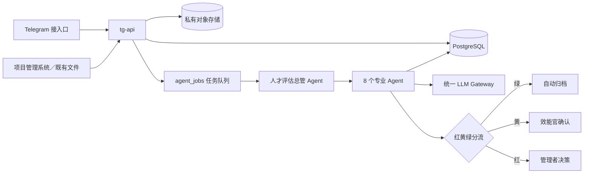

# Talent Evaluate｜效能中心人才评估 Agent 系统

本仓库保存效能中心人才评估系统的架构、治理规则、部署方案与后续实现代码。系统的目标不是用大模型替代管理判断，而是把项目与人员资料转换为可追溯事实，自动完成周报、月报与人才评估底稿，让效能官只处理例外与争议。

> 本仓库目前为公开仓库。禁止提交员工姓名、人才结论、原始周报／月报、项目与人员确认表、访问密钥或其他内部资料。所有示例必须去识别化。

## 核心原则

1. 事实先于评价：所有结论必须能回到来源、任务、交付、验收与时间。
2. 已发生的事实只证明当前已验证能力，不直接代表未来潜力。
3. 潜力只作为多周期趋势信号，不由单次项目或主观描述直接判定。
4. 人工保留最终人才定级、敏感负面结论与管理处置权。
5. 以滚动事实账本复用历史资料，避免每月重复填写、重复评估。
6. Agent 输出结构化候选结果，不直接改写正式人才档案。

## 架构速览



## 文档索引

- [当前工作交接](docs/HANDOFF.md)
- [Agent 能力驗收台：操作與開發部署](docs/development/acceptance-lab.md)
- [後續七個 Agent 的驗收契約](docs/development/future-agent-acceptance.md)
- [运行第一阶段 Agent 与本地演示](docs/development/intake-mvp.md)
- [系统架构](docs/architecture/system-architecture.md)
- [Agent 分工与编排](docs/architecture/agent-orchestration.md)
- [数据模型与事实账本](docs/architecture/data-model.md)
- [人才评估方法与治理边界](docs/governance/evaluation-method.md)
- [文件上传规范](docs/governance/file-upload-standard.md)
- [安全、隐私与权限](docs/governance/security-and-privacy.md)
- [仓库与跨电脑交接流程](docs/governance/repository-workflow.md)
- [Railway 一体化部署](docs/deployment/railway.md)
- [MVP 实施路线](docs/roadmap/mvp.md)
- [互动式架构可视化](architecture-visualization/dist/index.html)

## 代码与文档结构

```text
app/
  api/                 # Telegram webhook、上传、回调与管理 API
  agents/collection.py # 第一阶段资料收集 Agent
  supervisor.py        # 归档、版本、重复与异常路由
  worker.py            # 异步下载、解析与通知执行
  queue.py             # PostgreSQL 任务领取、租约与重试
  parsers.py           # HTML、JSON、CSV、Excel、Word 解析
  periods.py           # 日期／周次与正文期间检查
  database.py          # 收件、来源、批次、任务与审计
  storage.py           # 本地开发／生产 S3 存储
  telegram.py          # Telegram HTTP 客户端
  cli.py               # 本地演示与管理员状态查询
migrations/            # 数据库迁移
tests/                 # 单元、集成与回归测试
docs/                  # 架构、治理、部署与路线图
architecture-visualization/
```

## 目前状态

新增瀏覽器能力驗收台：資料收集與總管收件切片可試跑，並排查看輸入／標準答案／實際結果，核准或退回答案、版本比較、私有執行快照及稽核。公開倉庫只有 36 個合成案例；12 個真實材料衍生的歷史格式案例留在本地私有庫。工程測試與業務驗收分開，答案未核准不能標示達標。詳見[驗收台說明](docs/development/acceptance-lab.md)。Railway 尚未部署。

第一阶段已可运行：Telegram 私聊收件、总管的收件归档流程、资料收集 Agent、数据库迁移、文件解析、日期／周次检查、版本与文件重复检查、状态通知及审计。可先用匿名示例在本地演示，无需 Bot Token 或大模型密钥。启动命令与限制见[开发说明](docs/development/intake-mvp.md)。

目前停在 `NORMALIZED` 来源归档；提取文字仍是未核验资料。人员身份归档、项目语义去重、贡献核验、周月报生成及能力／潜力分析将按后续阶段实现。生产 Telegram 与 Railway 尚未连接。

## 跨电脑与跨 Agent 交接

每次推送都必须同步更新 `docs/HANDOFF.md`。Codex、Claude 或其他贡献者开始工作前，应先阅读 `AGENTS.md` 与当前交接文件；GitHub Actions 会检查每次推送是否包含交接更新。
