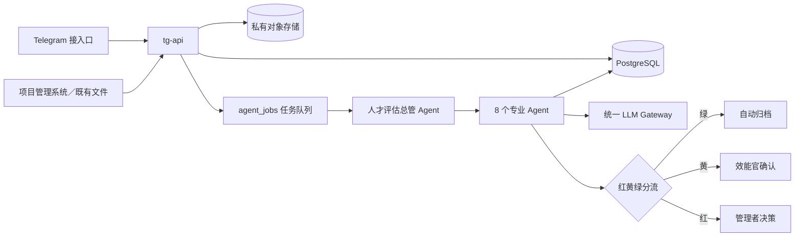

# Talent Evaluate｜效能中心人才评估 Agent 系统

本仓库保存效能中心人才评估系统的架构、治理规则、部署方案与后续实现代码。系统的目标不是用大模型替代管理判断，而是把项目与人员资料转换为可追溯事实，自动完成周报、月报与人才评估底稿，让效能官只处理例外与争议。

> 本仓库目前为公开仓库。禁止提交员工姓名、人才结论、原始周报／月报、项目与人员确认表、访问密钥或其他内部资料。所有示例必须去识别化。

## 核心原则

1. 事实先于评价：所有结论必须能回到来源、任务、交付、验收与时间。
2. 已发生的事实只证明当前已验证能力，不直接代表未来潜力。
3. 潜力只作为多周期趋势信号，不由单次项目或主观描述直接判定。
4. 人工保留最终人才定级、敏感负面结论与管理处置权。
5. 以滚动事实账本复用历史资料，避免每月重复填写、重复评估。
6. Agent 输出结构化候选结果，不直接改写正式人才档案。

## 架构速览



## 文档索引

- [系统架构](docs/architecture/system-architecture.md)
- [Agent 分工与编排](docs/architecture/agent-orchestration.md)
- [数据模型与事实账本](docs/architecture/data-model.md)
- [人才评估方法与治理边界](docs/governance/evaluation-method.md)
- [文件上传规范](docs/governance/file-upload-standard.md)
- [安全、隐私与权限](docs/governance/security-and-privacy.md)
- [Railway 一体化部署](docs/deployment/railway.md)
- [MVP 实施路线](docs/roadmap/mvp.md)
- [互动式架构可视化](architecture-visualization/dist/index.html)

## 规划中的代码结构

```text
app/
  api/                 # Telegram webhook、上传、回调与管理 API
  supervisor/          # 总管状态机、任务依赖与异常升级
  agents/              # 8 个专业 Agent
  parsers/             # Excel、Word、HTML、PDF 解析
  rules/               # 评估规则、证据等级与分流逻辑
  services/            # 对象存储、通知、报告与 LLM Gateway
  database/            # ORM、仓储层与交易边界
migrations/            # 数据库迁移
templates/             # 报告与输出模板
tests/                 # 单元、集成与回归测试
docs/                  # 架构、治理、部署与路线图
architecture-visualization/
```

## 目前状态

当前版本完成架构与治理基线留存。建议下一步先实现“不自动给最终人才等级”的 MVP：文件接入、格式校验、身份归档、日期／周次核对、项目去重、事实账本、异常确认，以及周报／月报自动输出。

