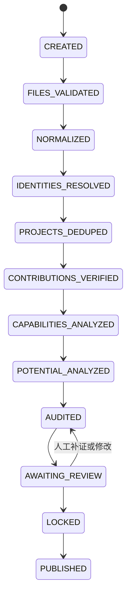

# Agent 分工与编排

## 1. 总管 Agent

人才评估总管 Agent 是任务调度与质量控制中心，负责：

- 建立评估批次与应收资料清单；
- 按公司、人员、期间和任务依赖拆分工作；
- 追踪专业 Agent 的开始、完成、失败与重试；
- 检查证据完整性、规则版本和冲突；
- 执行红黄绿分流并建立人工待办；
- 记录每次输入、输出、模型、提示版本与人工修改。

总管不得直接决定员工能力、潜力或最终人才等级。

## 2. 八个专业 Agent

| # | Agent | 核心输入 | 完成条件 | 主要升级条件 |
|---:|---|---|---|---|
| 1 | 资料收集 | 应收清单、文件、系统来源 | 期间、版本、来源、日期与周次已核对 | 缺件、加密、损坏、日期／周次冲突 |
| 2 | 身份归档 | 人名、公司、职位、别名、暂代关系 | 绑定唯一人员 ID 或标记待确认 | 同名多人、跨公司冲突、未知人员 |
| 3 | 项目去重 | 项目名称、期间、目标、成员、交付 | 合并同一项目轨迹或保留独立项目 | 相似但关键事实矛盾 |
| 4 | 贡献核验 | 任务、角色、交付、验收与证据 | 形成带证据等级的贡献事实 | 仅有主观描述、多人争议、无验收 |
| 5 | 能力边界 | 已核验贡献、难度、支持程度、稳定性 | 形成能力新增／增强／不变候选 | 一次性事件不足以证明稳定承担 |
| 6 | 潜力信号 | 多周期学习、独立交付与迁移事件 | 形成带充分度的趋势信号 | 样本不足、结果受外部因素主导 |
| 7 | 独立审核 | 所有候选结论、证据索引与规则版本 | 结论与证据一致，冲突已列出 | Agent 间矛盾、证据不可验证 |
| 8 | 报告生成 | 已审核事实、能力变化、待决策事项 | 生成周报、月报或评估底稿 | 输出包含未确认敏感结论 |

## 3. 批次状态机



每个状态转换均须幂等，可安全重试；正式档案只能在人工确认或满足自动归档规则后更新。

## 4. 红黄绿分流

- 绿色：来源可靠、字段完整、规则一致、无敏感结论；自动归档。
- 黄色：存在低信心匹配、缺少次要字段或轻微冲突；交效能官一键确认或修正。
- 红色：人才定级、敏感负面评价、重大归属争议、证据矛盾或规则外事项；交管理者决定。

## 5. Agent 输出契约

所有 Agent 只返回结构化候选结果，至少包含：

```json
{
  "batch_id": "uuid",
  "agent_type": "contribution_verification",
  "subject_ids": ["person-or-project-id"],
  "status": "completed_with_review",
  "candidates": [],
  "evidence_refs": [],
  "confidence": 0.82,
  "rule_version": "2026-09-01",
  "model_trace_id": "trace-id",
  "issues": [],
  "recommended_route": "yellow"
}
```

正式资料的写入由应用服务完成，并受交易、权限及审计控制；模型不能直接连接数据库执行任意写入。

