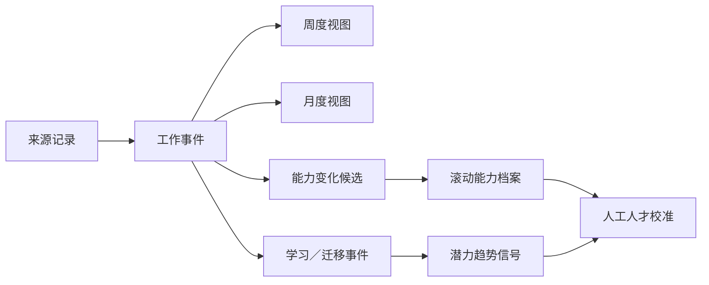

# 数据模型与事实账本

## 1. 数据分层

系统将“来源资料”“已核验事实”“分析候选”“正式评估”分开保存，避免模型摘要覆盖原始证据。

| 层级 | 典型实体 | 说明 |
|---|---|---|
| 主数据 | `companies`、`people`、`person_aliases`、`officer_assignments`、`projects`、`project_aliases` | 稳定身份与归属关系 |
| 来源层 | `source_systems`、`source_files`、`source_records`、`evidence` | 原始来源、哈希、版本、定位信息 |
| 事实层 | `work_events`、`project_milestones`、`contributions` | 已发生、可追溯、可复用的事实 |
| 编排层 | `evaluation_batches`、`agent_jobs`、`agent_runs`、`agent_results`、`agent_conflicts` | 任务状态、模型轨迹与冲突 |
| 审核层 | `review_tasks`、`decision_logs` | 人工确认、修改原因与最终决策 |
| 人才层 | `capability_definitions`、`capability_records`、`learning_events`、`potential_signals`、`talent_assessments`、`assessment_versions` | 滚动能力档案与多周期趋势 |

## 2. 事实的最小结构

一条可用于人才评估的事实，至少应回答：

- 谁：唯一人员 ID、所属公司、当时角色；
- 做了什么：任务、责任范围、项目与期间；
- 结果是什么：交付物、验收状态、业务或效能结果；
- 如何完成：独立／协作、所需支持、工具与约束；
- 证据在哪里：来源文件、项目记录、字段／段落定位；
- 何时确认：系统解析、效能官确认、管理者裁决的时间与版本。

## 3. 滚动复用

周报不是新的事实来源副本，而是对本周事件的视图；月报由已确认周度事件聚合；人才评估从跨周期事实与变化事件生成。历史记录不重建，只新增事件、修正版本或撤销记录。

## 4. 去重与版本

- 文件以 SHA-256、业务期间、公司、文档类型和版本共同识别；
- 相同哈希不重复处理，新版本不得覆盖旧版本；
- 项目以稳定 ID 优先；无 ID 时以目标、成员、期间、交付物及名称相似度生成候选；
- 合并只合并身份，不删除来源，保留每条原始记录与判断理由；
- 日期和周次分别解析并交叉验证，不能只相信文件名中的任一项。

