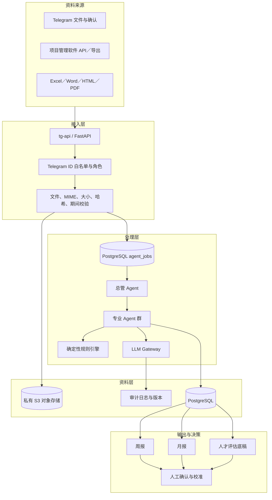

# 系统架构

## 1. 建设目标

系统以 Telegram 为使用入口，以 Railway 为一体化运行平台。效能官不再重复撰写周报、月报或人才评估说明；系统从自然工作产出的文件及项目系统记录中提取事实，建立可复用、可追溯的事实账本，再生成管理输出。

## 2. 逻辑架构

## 3. Railway 服务划分

| 服务 | 是否公开 | 责任 |
|---|---:|---|
| `tg-api` | 是 | Telegram webhook、权限、文件接收、确认按钮、管理 API |
| `agent-worker` | 否 | 总管 Agent、8 个专业 Agent、解析与任务执行 |
| PostgreSQL | 否 | 事实账本、任务队列、人才档案、审计记录 |
| Railway Bucket | 否 | 原始文件、解析产物、生成报告 |
| `weekly-cron` | 否 | 建立每周汇总任务后退出 |
| `monthly-cron` | 否 | 建立月度核对与汇总任务后退出 |
| `backup-cron` | 否 | 执行逻辑备份与异地备份任务后退出 |

首版不强制引入 Redis。任务队列使用 PostgreSQL `agent_jobs`，通过行锁与重试字段保证并发安全；当吞吐或实时性出现明确瓶颈后再增加 Redis。

## 4. 技术栈

- Python 3.12、FastAPI、aiogram、Pydantic
- SQLAlchemy、Alembic、PostgreSQL
- boto3／S3-compatible API
- openpyxl、pandas、python-docx、BeautifulSoup、pypdf
- Anthropic／OpenAI 官方 SDK，经统一 LLM Gateway 调用
- Jinja2、openpyxl／xlsxwriter 生成报告
- Docker、pytest、GitHub Actions

## 5. 模型使用边界

| 场景 | 优先机制 |
|---|---|
| 文件格式、日期、周次、哈希、版本 | 确定性程序 |
| 身份别名、项目候选匹配 | 规则＋相似度；低信心人工确认 |
| 叙述转结构化事实 | 大模型输出受 JSON Schema 约束 |
| 贡献与能力候选分析 | 大模型＋证据引用＋规则校验 |
| 潜力趋势摘要 | 多周期事实基础上的大模型辅助 |
| 最终人才等级与敏感处置 | 人工决定 |

生产环境使用模型 API，不把 Claude CLI 当作运行时依赖。CLI 只适合开发、评审或一次性离线辅助。

