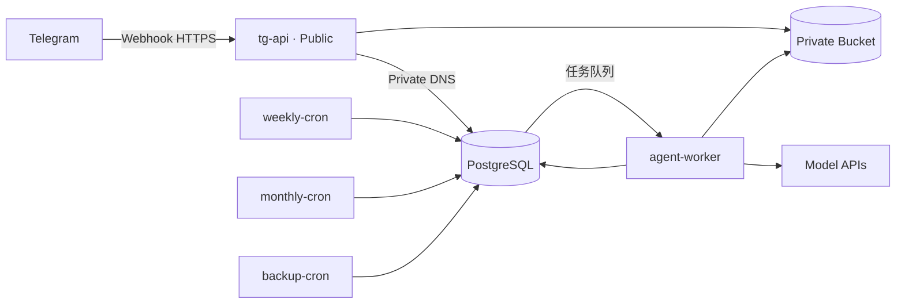

# Railway 一体化部署方案

这是完整目标拓扑。第一阶段的实际镜像、服务命令、环境变量和迁移步骤以[资料收集开发说明](../development/intake-mvp.md)为准；当前只实现 API、worker、数据库和对象存储，尚未实现定时汇总与备份任务。

## 1. 部署拓扑



## 2. 单一代码库、单一镜像

各服务使用同一份代码和 Docker 镜像，通过不同启动命令区分角色：

```text
tg-api         -> uvicorn app.api.main:create_app --factory --host 0.0.0.0 --port $PORT
agent-worker   -> python -m app.worker
weekly-cron    -> python -m app.scripts.enqueue_weekly
monthly-cron   -> python -m app.scripts.enqueue_monthly
backup-cron    -> python -m app.scripts.backup
```

Cron 程序必须完成工作后主动退出；上一次任务未结束时，下一次运行可能被跳过，因此 Cron 只负责入队，长任务由 worker 执行。

## 3. 建议环境变量

```text
APP_ENV
DATABASE_URL
TELEGRAM_BOT_TOKEN
TELEGRAM_WEBHOOK_SECRET
TELEGRAM_ALLOWED_USER_IDS
S3_ENDPOINT_URL
S3_BUCKET_NAME
S3_ACCESS_KEY_ID
S3_SECRET_ACCESS_KEY
ANTHROPIC_API_KEY
OPENAI_API_KEY
PRIMARY_MODEL_PROVIDER
PRIMARY_MODEL_NAME
REVIEW_MODEL_NAME
LOG_LEVEL
```

真实值只配置在 Railway Variables；仓库只保留变量名称与说明。

## 4. 环境规划

- `staging`：使用脱敏样本验证解析、规则与报告；
- `production`：处理真实人员资料，只允许少数管理员进入；
- 区域优先选择 Singapore，以贴近团队与资料使用地点；
- 设置月度用量告警及 hard limit，模型调用另设每日／批次预算。

## 5. 估算与扩容原则

试行期可从 Railway Pro 的最低月费档开始，平台资源加模型 API 的粗略总成本预期约为每月 30–90 美元，实际以文件量、模型选择和并发为准。先收集单文件解析时间、单批次 token、失败重试与峰值并发，再决定是否增加 worker 副本或 Redis。

## 6. 上线检查

- [ ] Webhook 密钥验证与 Telegram ID 白名单启用
- [ ] 除 `tg-api` 外无公开服务
- [ ] 数据库迁移已在 staging 验证
- [ ] Bucket 为私有且下载使用短时签名 URL
- [ ] 模型输入已执行资料最小化
- [ ] 审计、告警、重试、死信与人工待办可用
- [ ] 备份已实际恢复验证
- [ ] 生产仓库与 Railway 项目访问者名单已确认
- [ ] 领导确认最终人才决策仍由人负责
