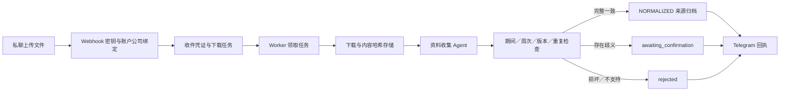

# 第一阶段：可运行的资料收集流程

本阶段已实现 Telegram 接入、资料收集 Agent 和总管的收件／归档流程。没有模型调用，也没有自动人才定级。解析出来的文字均为 **未核验来源片段**；不能当作已确认贡献。

## 已实现的路径



## 在新电脑启动

需要 Git 与 Python 3.12。数据库迁移是显式步骤，API 不会自动创建或改动表结构。

Windows PowerShell：

```powershell
py -3.12 -m venv .venv
.venv\Scripts\python.exe -m pip install -r requirements.txt -r requirements-dev.txt
.venv\Scripts\python.exe -m alembic upgrade head
.venv\Scripts\python.exe -m uvicorn app.api.main:create_app --factory --host 127.0.0.1 --port 8000
```

另开一个终端启动 worker：

```powershell
.venv\Scripts\python.exe -m app.worker
```

macOS／Linux 对应使用 `python3.12 -m venv .venv`，之后将命令中的 `.venv\Scripts\python.exe` 换成 `.venv/bin/python`。

默认采用 SQLite 与本地对象存储，全部写入被 Git 忽略的 `data/private/`。SQLite 仅用于单 worker 本地开发。正式环境必须使用 PostgreSQL 与共享 S3 Bucket。

## 无需 Telegram 的匿名演示

```powershell
.venv\Scripts\python.exe -m app.cli ingest "examples/DEMO_OFFICER01_周报_2026-W35_2026-08-24_2026-08-30_v01.html" --company DEMO --officer OFFICER01
.venv\Scripts\python.exe -m app.worker --once
.venv\Scripts\python.exe -m app.cli status <上一步输出的收件编号>
.venv\Scripts\python.exe -m app.cli jobs
```

预期结果为 `normalized`、`2026-W35`、`2026-08-24` 至 `2026-08-30`，证据状态是 `unverified_source`。重复导入同一文件应得到 `duplicate`，且不新增正式来源版本。

## Telegram 配置

将 `.env.example` 复制为 `.env` 后在本地填写真实值；不要提交 `.env`。

| 配置项 | 用途 |
|---|---|
| `TELEGRAM_BOT_TOKEN` | BotFather 签发的 Bot Token |
| `TELEGRAM_WEBHOOK_SECRET` | 自行生成的 32–256 字符随机密钥，仅用字母、数字、下划线和连字符 |
| `TELEGRAM_ACCOUNTS` | Telegram 用户 ID 对应公司代号与效能官代号的 JSON 对照表 |

账户示例仅示意格式：`{"123456":{"company_code":"DEMO","officer_code":"OFFICER01"}}`。公司和负责人以管理员绑定为准；文件名应以相同的 `公司代号_负责人代号_` 开头，否则进入待确认。真实编号与对应关系只保存在本地配置或 Railway Variables。

部署到 HTTPS 后，操作人员需调用 Telegram `setWebhook`，设置 URL 为 `https://<API域名>/telegram/webhook`、`secret_token` 为配置中的密钥、`allowed_updates` 为 `["message"]`。注册脚本应从环境读取 Token，避免将 Token 写进 shell 历史或日志。Webhook 校验方式见 [Telegram 官方说明](https://core.telegram.org/bots/api#setwebhook)。此版本不自动注册或修改线上 Bot。

仅接收已绑定用户的私聊文件。群聊和未授权用户会被忽略，避免重复投递。发送 `/help` 查看命名示例，`/status` 查询本人最近 5 次收件。重复的 Telegram update 不会重复创建工作。

## 日期与周次约定

- 本试点规范以 ISO 周（周一到周日）为准；旧资料的周制仍需业务确认。
- 同时检查档名中的日期范围、Wxx 和正文明确标示的“报告期间／報告期間／Reporting period”。
- 正文检查范围为前 40 个提取片段中的期间标签，以及 JSON 顶层 `period`／`reporting_period` 的 `start_date`、`end_date`。
- 单个档名日期可能是提交日期；只有日期时给出当周候选，并标记 `DATE_MAY_BE_PUBLICATION`，不会直接归档。
- 8 月 31 日上传、正文期间为 8 月 24–30 日时，以明确的正文期间为候选。若档名同时写 W36，则保留冲突并要求确认。
- 日期、周次或正文冲突都保留原始信息；不会静默选择某一项。
- 无法识别的正文期间标签不是“已验证一致”。当前属于保守、有限格式解析，未覆盖任意报告版式。

## 格式与版本

可解析 HTML/HTM、UTF-8 CSV/JSON、XLSX/XLSM、DOCX。宏、HTML 脚本及外部链接不执行。公式只保留公式文字并进入待确认，不计算结果。PDF、旧版 XLS、图片和压缩包目前返回 `FORMAT_NOT_SUPPORTED_YET`，没有假装成功。

原始文件最大 20,000,000 字节；同时检查声明大小和实际下载字节数。Telegram 公共 Bot API 的文件下载上限见 [getFile 官方说明](https://core.telegram.org/bots/api#getfile)。Office 压缩后文件还限制解压体积、条目数、行列数与提取字符总量；数据超过限制会拒绝整次解析，不静默截断。

文件使用公司范围内的 SHA-256 路径存储，读取时复核哈希。相同公司／效能官／类型／业务期间为一个归档批次；该批次内相同版本＋相同内容为重复上传，相同版本＋不同内容为版本冲突。版本号必须由文件名 `v01`、`v02` 等提供；较旧版本晚到不会覆盖最新版本。不同期间重复使用同一文件会被标记待确认。

## 任务恢复

Webhook 先持久化收件和任务再返回成功；worker 分离下载、解析、通知。PostgreSQL 使用行锁和 `SKIP LOCKED` 领取任务，适用依据见 [PostgreSQL 官方说明](https://www.postgresql.org/docs/current/sql-select.html#SQL-FOR-UPDATE-SHARE)。

任务默认租约 300 秒，失败最多尝试 3 次并退避。租约到期可重新领取，旧 worker 不能以失效凭证提交解析结果。数据库唯一键和事务控制重复版本。终止失败保留在 `agent_jobs`，`app.cli jobs` 可查看统计；收件处理失败显示为 `processing_failed`。此版本尚无人工重试界面，修正原因后重新上传会创建新的任务。

Telegram 通知是至少一次发送：若 Telegram 已收消息但 worker 在保存完成状态前断线，恢复时可能重复通知。重复通知不改变资料归档或版本。

## Railway 启动命令

同一镜像用于两个服务；只有 API 暴露公网。API 和 worker 必须连接相同的 PostgreSQL 与 S3 Bucket。

```text
API:    uvicorn app.api.main:create_app --factory --host 0.0.0.0 --port $PORT
Worker: python -m app.worker
一次性迁移: alembic upgrade head
```

API 服务的 pre-deploy command 设置为 `alembic upgrade head`；worker 不并发执行迁移。首次上线先完成迁移，再启动 worker。健康检查路径为 `/health/ready`（检查数据库表），存活探针为 `/health/live`。容器使用非 root 用户，构建方式参考 [FastAPI 容器部署说明](https://fastapi.tiangolo.com/deployment/docker/)。

生产环境设置 `APP_ENV=production`、`DATABASE_URL`、`STORAGE_BACKEND=s3`、S3 相关配置和 Telegram 配置。配置不完整会启动失败，防止误用本地磁盘保存正式资料。

## 验证命令

```powershell
.venv\Scripts\python.exe -m ruff check app tests migrations
.venv\Scripts\python.exe -m pytest -q
.venv\Scripts\python.exe -m alembic check
```

本地没有 PostgreSQL 时，两个 PostgreSQL 并发测试会跳过。设置仅供测试的 `TEST_POSTGRES_URL` 后会在独立随机 schema 中验证并清理；切勿把生产数据库作为测试地址。GitHub Actions 提供 PostgreSQL 16，运行迁移检查、全部测试及 Docker 构建。

## 下一阶段

1. 建立身份归档 Agent：人员主数据、别名、公司归属与生效期间。
2. 加入 Telegram 期间／身份异常的一键确认，记录确认人和理由。
3. 建立项目去重及每周新增事件账本，再接入贡献核验。
4. 经过匿名标注样本验收后，加入结构化输出的 LLM Gateway。

当前未实现：完整总管 DAG、人员与项目主数据、人工确认按钮、PDF/OCR、周月报生成、贡献核验、能力／潜力分析、生产 Bot／Railway 部署。应收材料清单也尚未配置，因此不能把已收件状态等同于“全部公司已交齐”。
