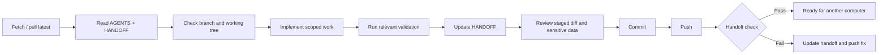

# Repository and Handoff Workflow

## Purpose

The project is developed across multiple computers and may be continued by Codex, Claude, or a human contributor. The repository must therefore contain enough current context for a new worker to continue safely without depending on chat history.

## Source of truth

- `AGENTS.md`: mandatory operating rules for every contributor and agent.
- `CLAUDE.md`: Claude entry point; redirects to the common rules.
- `docs/HANDOFF.md`: current work state, checks, blockers, and next actions.
- Architecture and governance documents: permanent decisions and specifications.
- Git history: exact versioned changes; it does not replace the handoff.

## Required workflow

## What belongs in the handoff

- Present phase and runtime status.
- Work completed in the push.
- Important files or modules changed.
- Commands or checks run and their result.
- Unresolved blockers, known defects, temporary decisions, and assumptions.
- Required environment, migration, deployment, or secret-name changes.
- Concrete next actions in priority order.

## What does not belong in the handoff

- API keys, tokens, passwords, connection strings, or private URLs.
- Real employee or officer names, talent grades, or management comments.
- Full original reports or copied source data.
- Long chat transcripts or obsolete progress narration.
- Permanent architectural detail that should be maintained in a dedicated document.

## Push-level enforcement

The GitHub Actions workflow compares the commit range in each push. At least one change to `docs/HANDOFF.md` must be present. This implements the rule at push level: several local commits may be pushed together, but the pushed range must contain a current handoff update.

Pull requests also check the complete PR diff. A PR cannot satisfy the policy solely through an earlier change already present in its base branch.

## Concurrent computers

Before starting, fetch the remote and check for divergence. Do not overwrite another computer's uncommitted work. Prefer short-lived feature branches for simultaneous work and merge only after the handoff accurately describes the integrated state.
